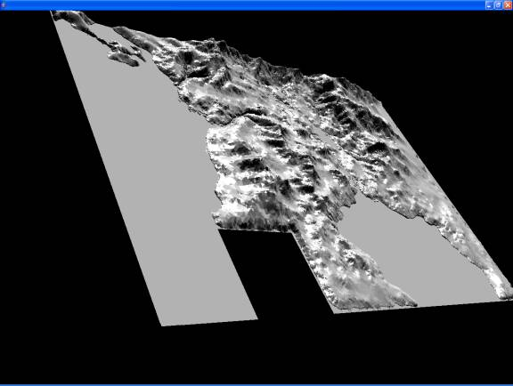
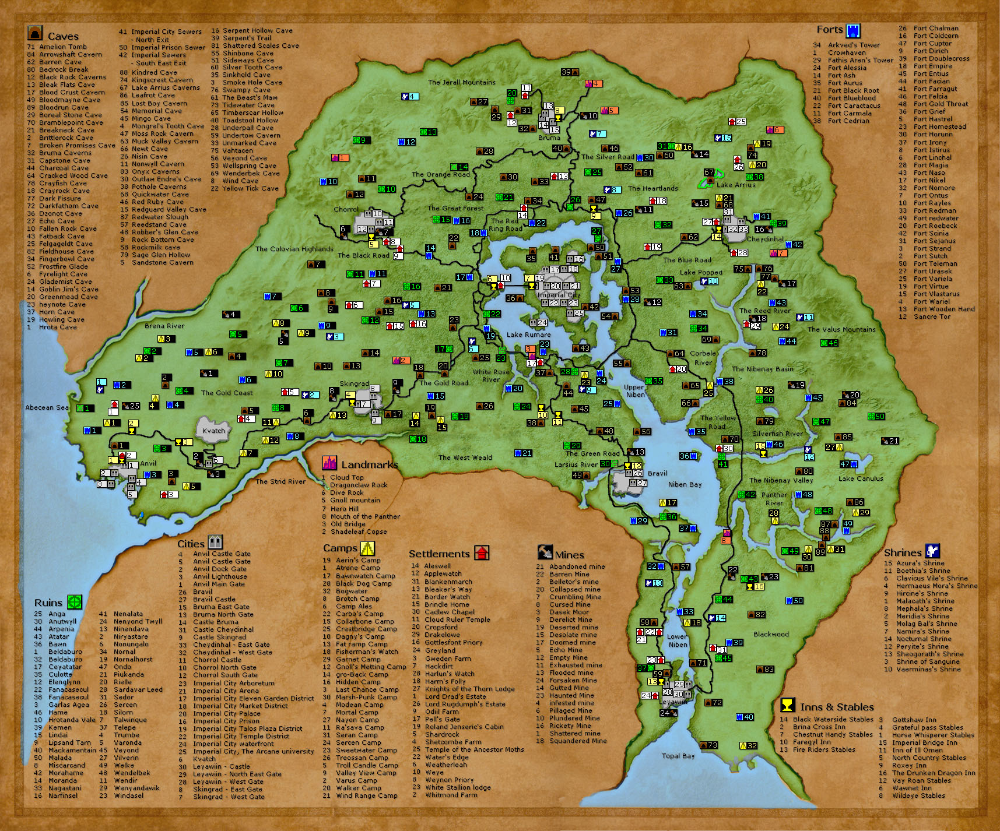

# Oblivion Landscape Viewer





A personal hack that parses The Elder Scrolls IV: Oblivion landscape mesh files (.nif format) and renders them in 3D. Built for fun.

Reads `.nif` files from the `landscape/` directory, extracts triangle strip vertex data, and displays the terrain with basic directional lighting.

## NIF Format

NIF (NetImmerse Format) is the binary mesh format used by Bethesda games. All values are little-endian.

### Triangle strips

What we want out of each file is a triangle strip — an efficient way to encode a mesh where every vertex after the first two implicitly forms a triangle with the previous two. N vertices = N-2 triangles, with no repeated vertex data. The GPU renders these directly with a single draw call.

Each Oblivion landscape `.nif` contains one `NiTriStripsData` block holding:
- A vertex array — the XYZ positions of every point in the terrain mesh
- One or more strip index arrays — sequences of indices into the vertex array that define the triangle strips

### File layout

```
Offset 0
  [header]            "Gamebryo File Format, Version 20.2.0.7\n" + version bytes + flags
                      48 bytes total

Offset 48
  [block count]       uint32  — number of blocks in the file
  [block type count]  uint32  — number of distinct block type name strings
  [block type names]  null-terminated ASCII strings  e.g. "NiTriStripsData", "NiNode"
  [block type index]  uint16 per block — maps each block to a type name
  [null refs]         0xFFFFFFFF sentinels separating block reference lists

  --- locate the 3rd 0xFFFFFFFF sentinel ---

  [vertex count]      uint16
  [vertices]          vertex_count × 12 bytes  (float x, float y, float z, little-endian)
                      Z-up coordinate system — swapped to Y-up at load time

  --- locate the next 0xFFFFFFFF sentinel ---

  [strip count]       uint16
  [strip lengths]     strip_count × uint16  — length of each strip
  [strip indices]     uint16 per entry — indices into the vertex array, one run per strip
```

### Coordinate system

NIF uses Z-up. The renderers swap Y and Z on load so the terrain sits upright in a Y-up world (standard for OpenGL/wgpu).

### Tile layout

Each `.nif` file is one landscape tile. Tiles are arranged in a grid with 131,072 units of spacing (matching Oblivion's cell size in NIF coordinate units).

## Implementations

| Directory | Language | 3D Library |
|---|---|---|
| `java/` | Java | Java3D |
| `java21/` | Java 21 | LWJGL |
| `kotlin/` | Kotlin | LWJGL |
| `rust/` | Rust | wgpu |
| `python/` | Python | wgpu-py |

## Running

**Java** — requires Java3D (Windows natives included in `java3d/`):
```sh
javac java/*.java
java -cp java startgui
```

**Java 21:**
```sh
cd java21 && gradle run
```

**Kotlin:**
```sh
cd kotlin && gradle run
```

**Rust:**
```sh
cd rust && cargo run --release
```

**Python:**
```sh
pip install -r python/requirements.txt
python python/main.py
```
